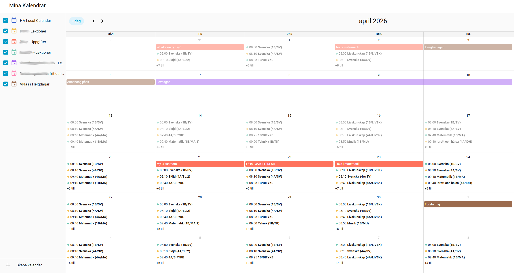
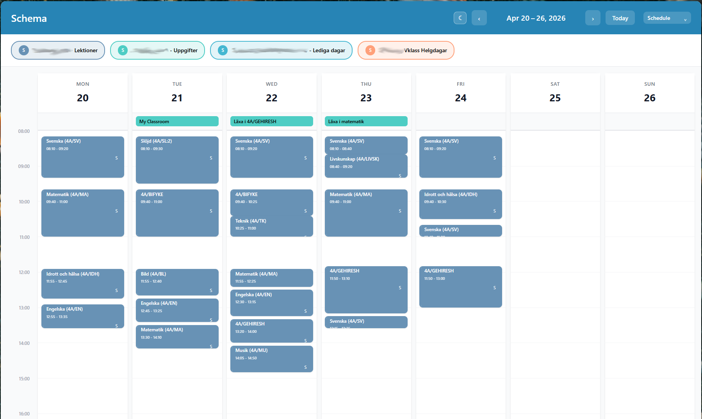
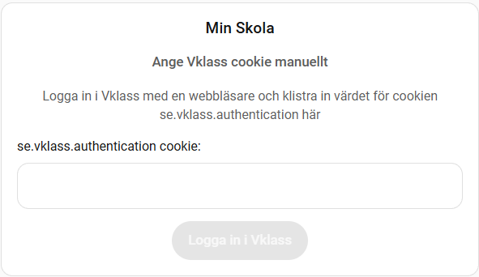
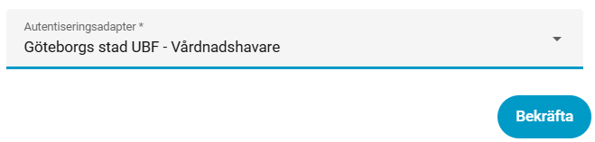
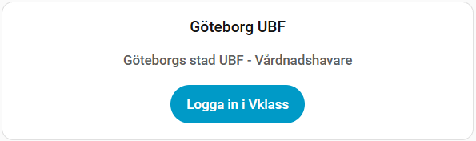
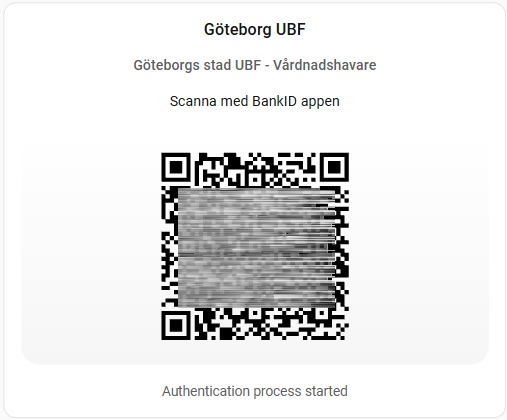

<br>
 

# Vklass integration for Home Assistant 

Vklass custom component for Home Assistant integrated with the Vklass platform used in Swedish schools.
Intended for guardian login. Features/entities are kept under a configured Vklass device. 

Integration also installs the vklass-auth-card to handle authentication via Lovelace UI.

<a href="media/calendar_view.png">
  
</a>
&nbsp;
<a href="media/calendar_view2.png">
  
</a>


## Installation
Use HACS or clone manually

## Feature set

* Calendar integration
  * Replicates the Vklass calendar design for all students in the account.
  * Creates calendar entities on the form `calendar.<student>_<event type>`, just like the structure in Vklass. Calendars are dynamically created from event types found in Vklass calendar data for each student.
    * "Lektioner" - the lesson schedule
    * "Uppgifter" - assignments, typically homework
    * "Händelser" - other things
    * "Lediga dagar" - vacation, public holidays etc
    * "Planering" - not really sure what this is
    * "Praktik" - Work Placement / Internship, etc
  * 12 month data fetched once per day, 2 month data fetched hourly.

## Vklass Authentication

How you login to Vklass differs depending on what municipality you belong to. The main authentication methods are:
* `vklass provided login` at https://auth.vklass.se/:
  * BankID login (using personal identity number)
  * Freja eID
  * Username/password
* `School or municipality partner login`, eg the "-- Välj Organisation --" drop-down list

The Vklass integration provides ***native support*** for some login methods, eg the integration lets you login directly via the lovelace card.

### Authentication Fallback
If native support is not available for your login method, the fallback is to login to Vklass in a browser and manually paste the value of the `se.vklass.authentication` cookie into the lovelace card. 
<br>
<br>
Although this login method is somewhat messy, the integration will keep the session alive. From testing, so far the session has not been terminated yet, alive +1 months now.

The `vklass.login` service lets you automate that however you want, so yo can skip the copy/paste in the card. Maybe you find a more convinient method of retrieving the cookie.

## Natively Supported Login Methods

If your Vklass login method can be choosen during setup, you will be able to sign in directly via the lovelace card. *(eg someone  wrote an auth adapter for it)*

Example with Götborg UBF, login with BankID QR:

*Config:<br>*
<br>
*Card:<br>*
<br>
<br>

### Current native login  methods
*eg auth adapters exist for:*
* `Manual Cookie`
* `Göteborg Stad UBF - Vårdnadshavare`
* `Göteborg Stad GSF - Vårdnadshavare` *(untested but seems same as UBF)*
* `Vklass inloggning med användarnamn/lösenord` *(untested, implementation is a rip from [this post](https://community.home-assistant.io/t/vklass-scrape-sensor/939402) by @fatuuse*

<br>

<br>
Since I cannot test methods other than what my school allows, I cannot develop/verify other methods.<br>
[Writing an auth adapter](#writing-an-auth-adapter) is pretty straight forward. Please support if you can!


## The Vklass Authentication Card
The card is installed automatically and provides a UI for the authentication process as a convinience method. It is configured with the auth sensor entity and reacts to it's state and attributes.

The typical usage is to display the card only when the state of the auth sensor is != `"success"`
```yaml
type: custom:vklass-auth-card
entity: sensor.vklass_myschool_auth
visibility:
  - condition: state
    entity: sensor.vklass_myschool_auth
    state_not: success
```

 <br>
Be aware, checking **Save credentials** stores the username and password in Home Assistant storage in plain text. Since the keep-alive keeps the session running and refreshed, you should rarely need to re-authenticate. So if you are not 100% comfortable with your local network security. Maybe dont check this box.

## Writing an auth adapter

The job of an auth adapter is getting the `se.vklass.authentication` cookie into the aiohttp_session. Framework handles it from there. 

Auth adapters live in `custom_components/vklass/auth_adapters/`.
No other modification to the integration is needed to support additional auth flows

The basic idea is simple:
* add a new python file for your login method
* expose it through `AUTH_ADAPTERS`
* set the authentication method `AUTH_METHOD_USERPASS | AUTH_METHOD_BANKID_PERSONNO | AUTH_METHOD_BANKID_QR | AUTH_METHOD_CUSTOM`
* implement an async auth function that performs the login flow in the provided `aiohttp` session
* return `True` when the flow has completed and the Vklass auth cookie should now exist in the session
* `raise` on errors rather than returning `False` to be a bit more informative, on `False` the integration will just raise a generic PermissionError for you.

Minimal shape:

```python
from ..const import (
    AUTH_ADAPTER_ATTR_TITLE,
    AUTH_ADAPTER_ATTR_METHOD,
    AUTH_ADAPTER_ATTR_AUTH_FUNCTION,
    AUTH_METHOD_USERPASS,
)

AUTH_ADAPTERS = {
    "my_adapter": {
        AUTH_ADAPTER_ATTR_TITLE: "<Same text here as in Vklass auth page>",
        AUTH_ADAPTER_ATTR_METHOD: AUTH_METHOD_USERPASS, 
        AUTH_ADAPTER_ATTR_AUTH_FUNCTION: "authenticate",
    }
}

async def authenticate(aiohttp_session, asyncQrNotifyHandler, credentials) -> bool:
    ...
    return True
```

#### `AUTH_ADAPTER_ATTR_METHOD`

* `AUTH_METHOD_USERPASS` - Card shows username/password fields. Passed to the auth adapter
* `AUTH_METHOD_BANKID_PERSONNO` - Card shows field for personal identity number. Passed to the auth adapter
* `AUTH_METHOD_BANKID_QR` - Card shows and updates QR code when new data from the adapter is available
* `AUTH_METHOD_CUSTOM` - Some other clever way of getting the `se.vklass.authentication` into the aiohttp_session

<br>

`credentials` parameter to the authenticate function have the following data structure
```python
# AUTH_METHOD_BANKID_QR:          credentials:None = None
# AUTH_METHOD_BANKID_PERSONNO     credentials:dict = {"personno": <"personal number">}
# AUTH_METHOD_USERPASS            credentials:dict = {"username": <"username">, "password":<"password">}
# AUTH_METHOD_MANUAL_COOKIE       credentials:dict = {"cookie":   <"cookie value">}
# AUTH_METHOD_CUSTOM:             credentials:None = None
```

#### `AUTH_METHOD_BANKID_QR`
To pass the qr code updates to the lovelace card, an adapter uses:<br>
`async def asyncQrNotifyHandler (<qr_data>, <qr_type>)`.

<qr_type> as:
```python
QR_CODE_TYPE_SEED         
# <qr_data> of type "bankid.211a33b8-a2a1-45dc-98c6-104ab2915bbe..."
QR_CODE_TYPE_IMAGE_PNG    
# <qr data> is PNG data - typically from src="data:image/png;base64,iVBORw0KG...". 
# <qr data> as base64 encoded string only, remove "data:image/png;base64,"
QR_CODE_TYPE_IMAGE_SVG
# <qr_data> as raw SVG markup string, for example "<svg ...>...</svg>"
# pass only the SVG itself, not surrounding JSON, HTML, or  wrappers
```


<br>

*Other notes*:

* use the provided `aiohttp_session` for the full login flow, so cookies and redirects stay in the same session
* if your flow shows a BankID QR code, eg `AUTH_METHOD_BANKID_QR`, call `asyncQrNotifyHandler(...)`


The easiest reference is `manual_cookie.py`.
It does not perform a full login flow, it just injects the `se.vklass.authentication` cookie into the session.

A more complete example is `goteborg_stad_bankid.py`.
That one shows a multi-step login flow with redirects, form parsing, QR updates and finally landing on an authenticated Vklass session.


## Developing

Use your favorite environment
<br>-- or --<br>
Use mine:

0. have docker installed
1. `git clone https://github.com/Kaptensanders/hass-custom-devcontainer.git`
2. `cd hass-custom-devcontainer`
3. `./helper build`
4. `git clone https://github.com/Kaptensanders/vklass.git`
5. Open devcontainer with vs code

Enter the container with `./attach`
Start Home Assistant (http://localhost:8123/) with `ha`
Login credentials `<dev>`/`<dev>`


